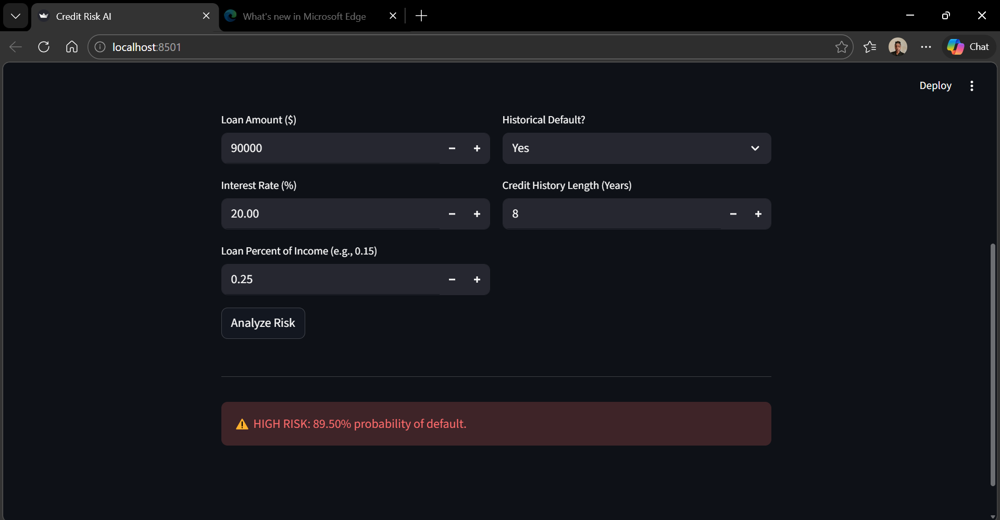
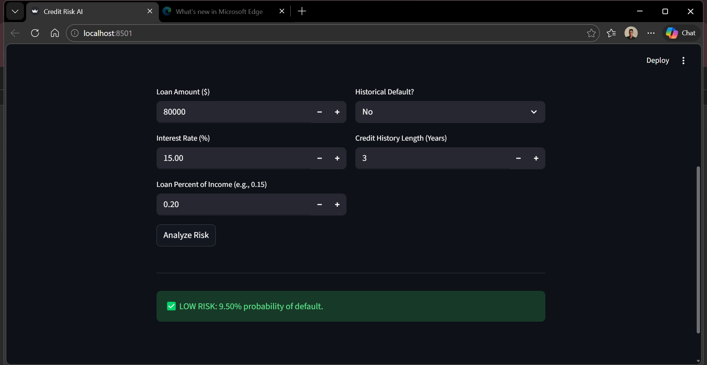
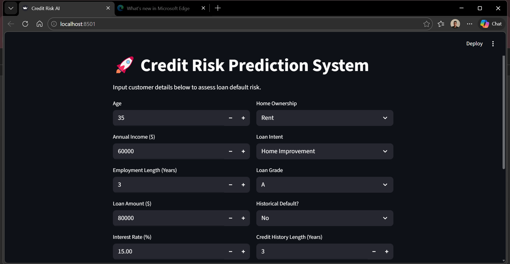
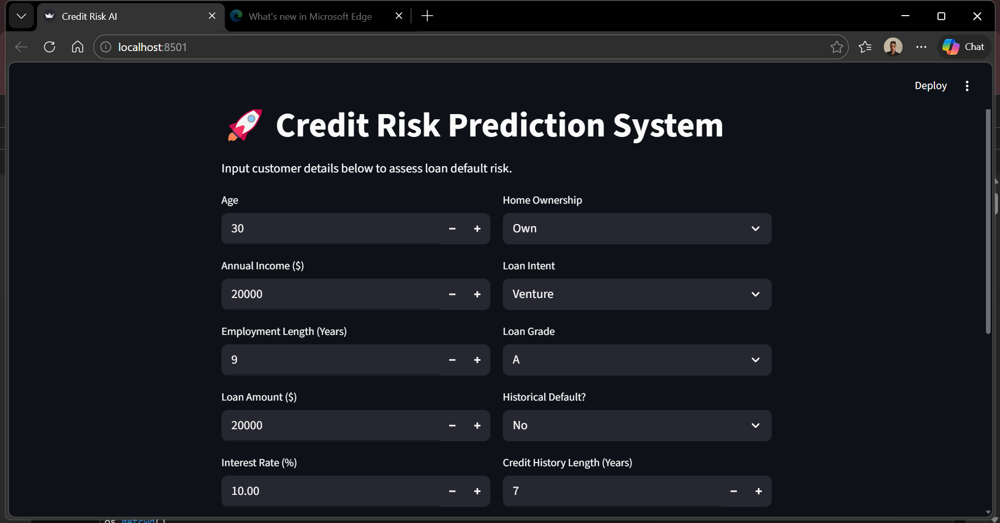
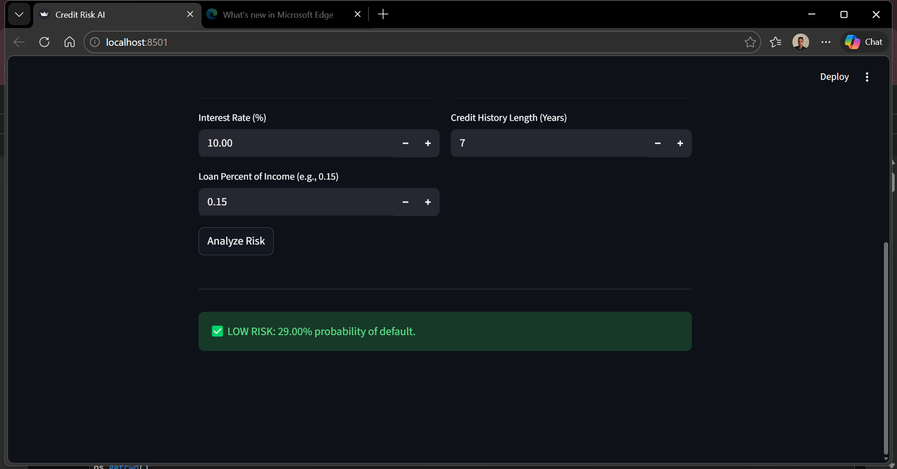
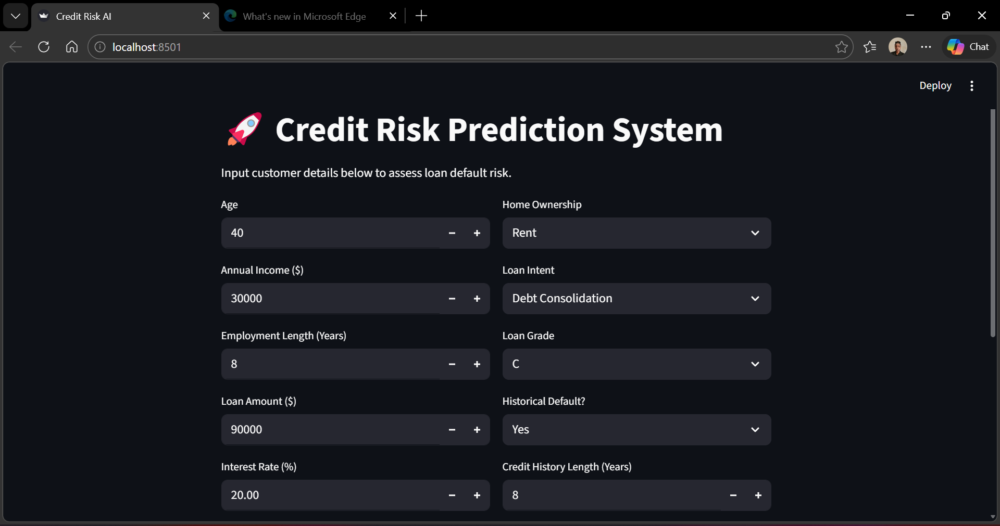

# 🚀 Credit Risk Prediction System

### **Business Case**
Financial institutions face significant losses due to inaccurate credit risk assessments. This project demonstrates an automated AI solution that predicts the probability of a loan applicant defaulting, allowing for faster, data-driven lending decisions.

---

## **🛠️ The Solution**
I developed a machine learning pipeline that processes customer financial data and provides a risk score through a user-friendly web interface.

### **Key Features:**
* **Predictive Engine:** Uses a Random Forest Classifier for high-accuracy risk detection.
* **Data Normalization:** Implements `StandardScaler` to ensure varied financial inputs (income vs. age) are processed correctly.
* **Interactive UI:** A Streamlit-based dashboard for real-time "What-If" analysis.

---

## **📊 Project Lifecycle**
1.  **Data Cleaning:** Handled missing values (employment length/interest rates) and removed outliers (unrealistic ages).
2.  **Feature Engineering:** Encoded categorical variables (Home Ownership, Loan Intent) and performed feature scaling.
3.  **Modeling:** Compared Logistic Regression against Random Forest; selected Random Forest for superior performance.
4.  **Deployment:** Exported the model and scaler using `Pickle` for integration into the Streamlit app.

---

## **💻 How to Run This Locally**

1. **Clone the repo:**
   ```bash
   git clone [https://github.com/JustAnn1234/credit-risk-prediction-ai.git](https://github.com/JustAnn1234/credit-risk-prediction-ai.git)
⚠️ Note: The model file is >25MB. You can download the credit_risk_model.pkl here (https://drive.google.com/file/d/1sYAPNK7EnSFFNHdX5VP5UqmNuvKOBs6V/view?usp=sharing) and place it in the project folder.







